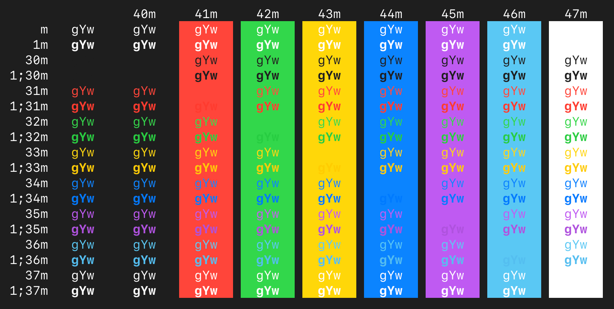

# Midnight In Monterey For iTerm

This theme is based on the dark mode colors initially set out in Apple's [Human Interface Guidelines](https://developer.apple.com/design/human-interface-guidelines/macos/overview/themes/), and implemented initially in [macOS Monterey](https://en.wikipedia.org/wiki/MacOS_Monterey).

